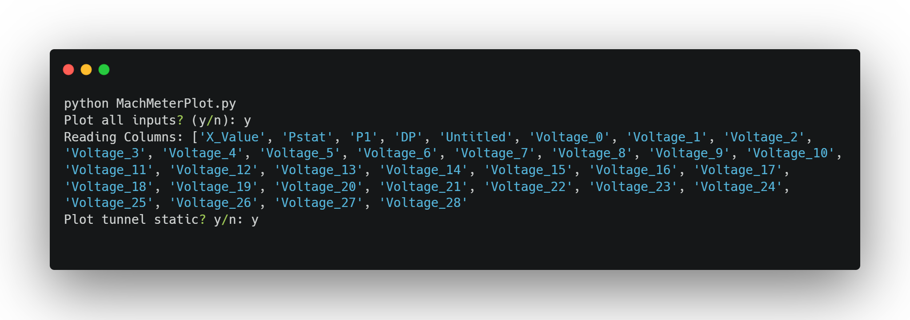
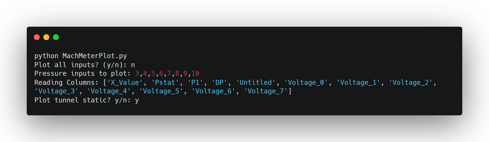
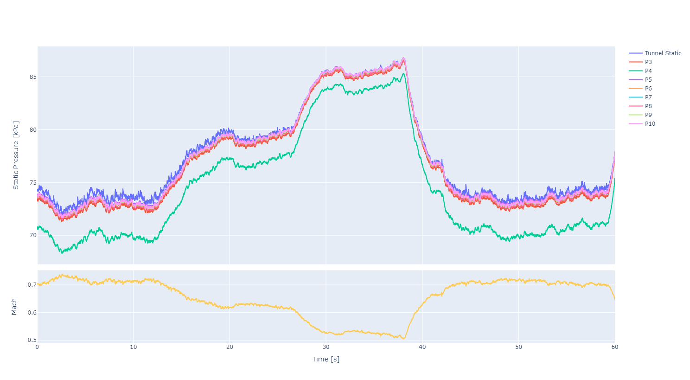

## Installation

In order to run the plotting script a number of Python packages will need to be installed. This is easily using the Python package manager. This can be done from a Windows command prompt or PowerShell window with the commands listed below. The required packages are:

* Pandas - `pip install pandas`
* Plotly - `pip install plotly`
* NumPy - `pip install numpy`
* Tkinter - `pip install tk`

The plotting script can now be run.

## Running the Script

Running the script can be done by calling the script in a command prompt or PowerShell terminal window, opening the `.py` file with Python from the file explorer or by opening the file in VS Code and running the script in the integrated terminal.

With a terminal window open in the script script folder, call the script with `python MachMeterPlot.py`. Once done, a file explorer window will open and the relevant `.lvm` file should be selected.
Once opened, the terminal will ask whether all channels should be plot. Answering with `y`, and confirming the input with the <kbd>ENTER</kbd> key, will plot all channels and the terminal will display the columns to be read from the file for verification. The user will then be asked whether to include the tunnel static pressure line on the plot - answer `y` or `n` to show or hide this channel.

Alternatively, the user can specify a custom set of transducer channels to be plot. Answering `n` will then prompt the user to enter the channels required to be plot. Channels should be specified by their transducer channel number and separated by a comma, as shown in the image below.

Again the user will then be asked if they wish to show or hide the tunnel static measurement on the resultant plot.

After either selection, the completed plot will open in a browser window for viewing and saving as an image via the camera icon in the upper right hand corner. The plot is fully interactive and can be panned and zoomed as required to the region of interest. Traces can be shown or hidden by selecting their entry in the legend. Below is an example of the output when a few channels are selected.

## Errors

On occasion, once the script reaches the plotting stage the browser window will open but the plot not display. In this case it is often necessary to close the terminal window and restart the procedure.
